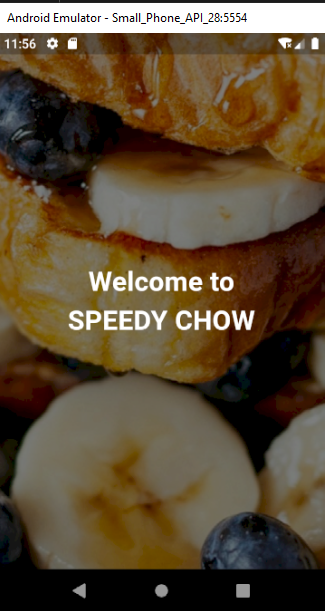
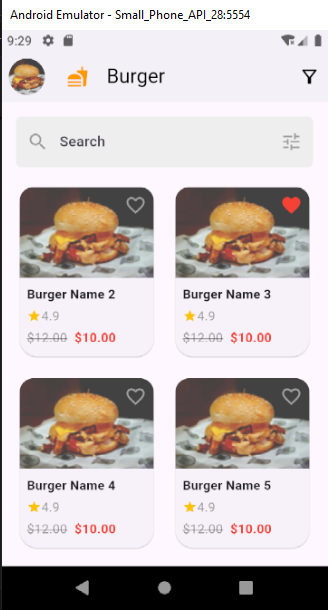
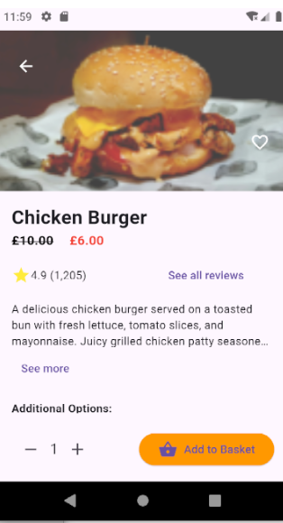
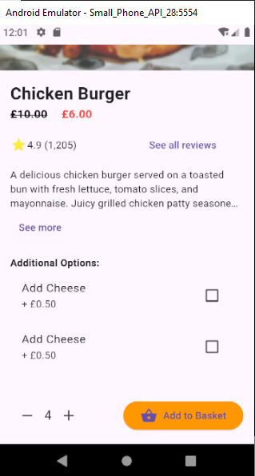

# Burger Delivery App

## Description

The Burger Delivery App is a mobile application designed for users to browse and order a variety of delicious burgers. The app allows users to view detailed information about each burger, customize their order with additional options, and seamlessly add items to their cart for checkout.

## Features

<<<<<<< HEAD
- **Splash Screen:**


 Welcomes users to the app with a dynamic splash screen before navigating to the home page.
  
- **Home Page (BurgerPage):**

    
  - Displays a grid of burger cards with images, names, prices, and ratings.
  - Includes a search bar to filter burgers and a filter icon for advanced options.
  - Navigate to detailed pages by tapping on any burger card.

- **Burger Details Page:**

    

    
    
  - Shows a full-screen image of the selected burger with a back button and favorite icon.
  - Displays burger name, original and discounted prices, rating, and the number of people who rated it.
  - Provides a description of the burger with a "See More" feature.
  - Allows customization with additional options (e.g., Add Cheese, Add Bacon) via checkboxes.
  - Includes a quantity selector with "+" and "-" buttons, and an "Add to Basket" button.

- **State Management:**
  - The app uses the BLoC (Business Logic Component) pattern to manage state, ensuring a smooth and responsive user experience.
  - Loaded burger data is fetched and managed using BLoC architecture.

- **Data Fetching:**
  - Burger data is fetched from a remote API, displaying real-time information including images, ratings, prices, and descriptions.
  - Implements clean architecture principles to separate concerns and improve maintainability.

## Installation

To run the app locally, follow these steps:

1. **Clone the Repository:**
    ```bash
    git clone https://github.com/libe12/mobile_A.git
    cd deliver_app,
    
    ```

2. **Install Dependencies:**
    ```bash
    flutter pub get

        http: ^1.2.2
        get_it: ^7.7.0
        equatable: ^2.0.3
        flutter_bloc: ^8.0.0 
    -
    ```

3. **Run the App:**
    ```bash
    flutter run
    ```

## Usage

- Launch the app on your emulator or device.
- Browse through the list of available burgers on the home page.
- Tap on a burger card to view detailed information and customize your order.
- Adjust the quantity and add the burger to your basket for checkout.

## Folder Structure
1. lib/
core/

error/
exceptions.dart (Defines custom exceptions)
failures.dart (Handles different types of failures)
usecase/
usecase.dart (Abstract class for all use cases)
utils/
constants.dart (App-wide constants)
input_converter.dart (Utility classes, e.g., for parsing)
platform/
network_info.dart (Abstract class for network status checking)
features/ (Each feature has its own folder)

lib/
├── bloc/                        # Contains Bloc implementations for state management
│   ├── burger_bloc.dart         # Bloc class for managing burger-related states and events
│   ├── burger_event.dart        # Events for the BurgerBloc
│   └── burger_state.dart        # States for the BurgerBloc
│
├── data/
│   ├── datasources/             # Data source classes for API interactions
│   │   └── burger_remote_data_source.dart
│   │
│   ├── models/                  # Data models representing the burger data structure
│   │   └── burger_model.dart
│   │
│   └── repositories/            # Repository classes that handle data fetching and processing
│       └── burger_repository_impl.dart
│
├── features/
│   ├── presentation/
│   │   ├── pages/               # Contains all the UI pages
│   │   │   ├── burger_page.dart           # Home page displaying burger options
│   │   │   ├── burger_details_page.dart   # Burger details page
│   │   │   └── splash_screen.dart         # Splash screen page
│   │   │
│   │   └── widgets/             # Reusable widgets like the BurgerCard
│   │       └── burger_card.dart
│
├── main.dart                    # Entry point of the application
└── README.md                    # Project overview and documentation
=======
- **Splash Screen:** Welcomes users to the app with a dynamic splash screen before navigating to the home page.
  
- **Home Page (BurgerPage):**

  - Displays a grid of burger cards with images, names, prices, and ratings.
  - Includes a search bar to filter burgers and a filter icon for advanced options.
  - Navigate to detailed pages by tapping on any burger card.

- **Burger Details Page:**
  - Shows a full-screen image of the selected burger with a back button and favorite icon.
  - Displays burger name, original and discounted prices, rating, and the number of people who rated it.
  - Provides a description of the burger with a "See More" feature.
  - Allows customization with additional options (e.g., Add Cheese, Add Bacon) via checkboxes.
  - Includes a quantity selector with "+" and "-" buttons, and an "Add to Basket" button.

- **State Management:**
  - The app uses the BLoC (Business Logic Component) pattern to manage state, ensuring a smooth and responsive user experience.
  - Loaded burger data is fetched and managed using BLoC architecture.

- **Data Fetching:**
  - Burger data is fetched from a remote API, displaying real-time information including images, ratings, prices, and descriptions.
  - Implements clean architecture principles to separate concerns and improve maintainability.

## Installation

To run the app locally, follow these steps:

1. **Clone the Repository:**
    ```bash
    git clone https://github.com/libe12/mobile_A.git
    cd deliver_app,
    
    ```

2. **Install Dependencies:**
    ```bash
    flutter pub get

        http: ^1.2.2
        get_it: ^7.7.0
        equatable: ^2.0.3
        flutter_bloc: ^8.0.0 
    -
    ```

3. **Run the App:**
    ```bash
    flutter run
    ```

## Usage

- Launch the app on your emulator or device.
- Browse through the list of available burgers on the home page.
- Tap on a burger card to view detailed information and customize your order.
- Adjust the quantity and add the burger to your basket for checkout.

## Folder Structure
1. lib/
core/

error/
exceptions.dart (Defines custom exceptions)
failures.dart (Handles different types of failures)
usecase/
usecase.dart (Abstract class for all use cases)
utils/
constants.dart (App-wide constants)
input_converter.dart (Utility classes, e.g., for parsing)
platform/
network_info.dart (Abstract class for network status checking)
features/ (Each feature has its own folder)

lib/
├── bloc/                        # Contains Bloc implementations for state management
│   ├── burger_bloc.dart         # Bloc class for managing burger-related states and events
│   ├── burger_event.dart        # Events for the BurgerBloc
│   └── burger_state.dart        # States for the BurgerBloc
│
├── data/
│   ├── datasources/             # Data source classes for API interactions
│   │   └── burger_remote_data_source.dart
│   │
│   ├── models/                  # Data models representing the burger data structure
│   │   └── burger_model.dart
│   │
│   └── repositories/            # Repository classes that handle data fetching and processing
│       └── burger_repository_impl.dart
│
├── features/
│   ├── presentation/
│   │   ├── pages/               # Contains all the UI pages
│   │   │   ├── burger_page.dart           # Home page displaying burger options
│   │   │   ├── burger_details_page.dart   # Burger details page
│   │   │   └── splash_screen.dart         # Splash screen page
│   │   │
│   │   └── widgets/             # Reusable widgets like the BurgerCard
│   │       └── burger_card.dart
│
├── main.dart                    # Entry point of the application
└── README.md                    # Project overview and documentation

>>>>>>> e9992fc94b217c76f2bda95eeb1587d5acc6b1e4

